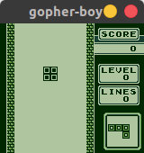
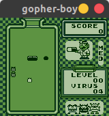

# gopher-boy

[](https://circleci.com/gh/bokuweb/gopher-boy/tree/master) [](https://goreportcard.com/report/github.com/bokuweb/gopher-boy)

　　

## Installation

you can install `gopher-boy` with following comand.

```sh
go get github.com/bokuweb/gopher-boy/cmd/gopher-boy
```

This emulator uses the go library [pixel](https://github.com/faiface/pixel), which requires OpenGL. You may need to install some requirements which can be found on the [pixels readme](https://github.com/faiface/pixel#requirements).

## Usage

```sh
gopher-boy YOUR_GAMEBOY_ROM.gb
```

### Keymap

| keyboard             | game pad      |
| -------------------- | ------------- |
| <kbd>&larr;</kbd>    | &larr; button |
| <kbd>&uarr;</kbd>    | &uarr; button |
| <kbd>&darr;</kbd>    | &darr; button |
| <kbd>&rarr;</kbd>    | &rarr; button |
| <kbd>Z</kbd>         | A button      |
| <kbd>X</kbd>         | B button      |
| <kbd>Enter</kbd>     | Start button  |
| <kbd>Backspace</kbd> | Select button |

## Testing

```
make test
```

### Current status

#### Blargg's test ROM

| ROM          | Result    |
| ------------ | --------- |
| cpu_instrs   | ✅        |
| instr_timing | ❌ (#255) |

#### mooneye-gb's test ROM

| ROM                           | Result |
| ----------------------------- | ------ |
| emulator-only/mbc1/bits_bank1 | ✅     |
| acceptance/instr/daa          | ✅     |
| acceptance/timer/div_write    | ✅     |
| acceptance/timer/tim00        | ✅     |
| acceptance/timer/tim01        | ✅     |
| acceptance/timer/tim10        | ✅     |
| acceptance/timer/tim11        | ✅     |
| acceptance/if_ie_registers    | ✅     |

### Visual regression test

Please install `reg-cli`.

```sh
npm i -g reg-cli
```

Execute regression test

```sh
make reg
```

Update expected images

```sh
make reg-update
```

## Known Bugs and TODO list

PR welcome :)

- [ ] Implement APU
- [ ] Support scale option
- [x] Support WebAssembly
- [ ] 8\*16 sprite
- [ ] LCD interrupt
- [ ] Keypad interrupt
- [ ] Support ROM+MBC1+RAM+BATT catridge
- [ ] Support ROM+MBC2 catridge
- [ ] Support ROM+MBC2+BATTERY catridge
- [ ] Support ROM+RAM catridge
- [ ] Support ROM+RAM+BATTERY catridge
- [ ] Support ROM+MMM01 catridge
- [ ] Support ROM+MMM01+SRAM catridge
- [ ] Support ROM+MMM01+SRAM+BATT catridge
- [ ] Support ROM+MBC3+RAM catridge
- [ ] Support ROM+MBC3+RAM+BATT catridge
- [ ] Support ROM+MBC5 catridge
- [ ] Support ROM+MBC5+RAM catridge
- [ ] Support ROM+MBC5+RAM+BATT catridge
- [ ] Support ROM+MBC5+RUMBLE catridge
- [ ] Support ROM+MBC5+RUMBLE+SRAM catridge
- [ ] Support ROM+MBC5+RUMBLE+SRAM+BATT catridge
- [ ] Support Pocket Camera catridge
- [ ] Support Bandai TAMA5 catridge
- [ ] Support Hudson HuC-3 catridge
